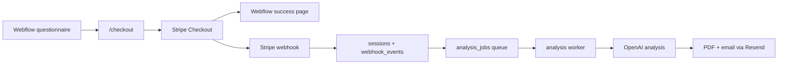

# NeuroMap Kids Project State

Last consolidated: 2026-06-04, Europe/Budapest

This file is the handoff memory for the NeuroMap Kids Webflow + Railway project. It summarizes the old ChatGPT threads, screenshots, Railway logs, current repo state, and the security hardening work already prepared in this repo.

Do not put real secrets in this file. Several old screenshots/logs exposed sensitive-looking values, so secrets must be rotated instead of documented.

## Quick Context For A New Chat

Project: NeuroMap Kids, a multilingual parent-facing questionnaire and paid AI report system.

Frontend:
- Webflow site: `https://neuromap-kids.webflow.io/`
- Frontend runs from Webflow embed blocks.
- Current main Webflow embed flow uses UI/config, triage bank, all-banks bundle, Webflow bridge, and engine.

Backend:
- Node/Express app on Railway.
- Repo: `odorbalazs-dev/neuromap-backend`
- User working directory: `C:\Users\odorb\neuromap-backend`
- Codex clone used during this session: `C:\Users\odorb\Documents\Codex\2026-05-17\mire-j-a-codex-mi-az\neuromap-backend`
- Runtime scripts:
  - `npm start` -> `node src/app/server.js`
  - `npm run worker` -> `node src/jobs/analysis.worker.js`

Main pipeline:



Current strategic recommendation from the old chat:
- Finish a focused engine/bank audit before building the next ANXIETY premium bank.
- Reason: ADHD/ASD/picker/bundle/prompt/report layers now act like a platform, so schema drift and bank-specific hacks would get expensive later.

## Current Repo State

The active repo is `C:\Users\odorb\neuromap-backend`.

Production entrypoints:
- Web server: `npm start` -> `node src/app/server.js`
- Analysis worker: `npm run worker` -> `node src/jobs/analysis.worker.js`
- Webflow engine loader: `web/engine-embed.full.html`
- Checkout success/cancel loader: `web/checkout-success-embed.html` and `web/checkout-cancel-embed.html`

Cleanup audit note, 2026-06-04:
- Removed unused legacy placeholder files from `src/domain`, `src/infrastructure`, `src/repositories`, and old `web` snippets.
- Removed the tracked empty root file `-H`.
- Kept the Webflow loader templates because the admin Embed Manager uses them.
- Simplified duplicate landing fallback text in `public/webflow/engine.js`.

## Security Hardening Prepared

The current uncommitted code changes include:

- Stripe webhook idempotency:
  - `src/services/webhook.service.js` now marks webhook events processed after queuing analysis.
- Analysis queue idempotency:
  - `src/db/migrations/005_analysis_jobs_idempotency.sql` deduplicates active jobs and adds a partial unique index on one active job per session.
  - `src/services/analysis-queue.service.js` uses `ON CONFLICT ... DO NOTHING` for queued/processing jobs.
  - `src/services/analysis-job.service.js` now processes from `analysis_jobs`.
- Retry path:
  - `src/api/controllers/admin.controller.js` retry also enqueues an analysis job.
- Checkout validation:
  - `src/api/controllers/checkout.controller.js` validates and normalizes checkout payloads again.
  - `src/utils/validateCheckoutPayload.js` validates language, email, field length, question counts, and question shape.
  - `src/utils/normalizeCheckoutPayload.js` caps/sanitizes text and array sizes.
- HTTP protection:
  - `src/middleware/security.js` adds security headers and in-memory rate limiting.
  - `src/app/server.js` applies rate limits to global, checkout, session, admin, cron, and jobs paths.
- Token handling:
  - `src/utils/secureCompare.js` provides timing-safe comparison.
  - `src/middleware/adminAuth.js` uses timing-safe compare.
  - `src/api/controllers/jobs.controller.js` accepts only `x-cron-secret`.
  - `src/api/controllers/cron.controller.js` accepts only `x-cron-secret`.
- Privacy:
  - `src/api/routes/health.js` no longer exposes detailed environment/debug info.
  - `src/services/stripe.service.js` removes email/name from Stripe metadata while keeping Stripe Checkout customer email.
- Dependency:
  - `path-to-regexp` patched via `package-lock.json`; `npm audit` clean.

## Secrets And Rotation

Important: old screenshots/logs showed sensitive-looking values. Treat them as exposed.

Rotate these before considering the system clean:
- Railway backend `ADMIN_TOKEN`
- Railway backend and worker `CRON_SECRET`
- Database password/URL if any full DB credential appeared in screenshots or CSV logs
- Any other token visible in screenshots, especially OpenAI, Stripe, Resend, Meta, or webhook-related values

After rotation:
- Update both backend and worker Railway services where relevant.
- Redeploy both services.
- Do not paste the new values into ChatGPT or commit them.

## Railway Services

Backend service:
- Runs Express server.
- Railway start command should be `npm run railway:start`.
- Leave `RAILWAY_SERVICE_ROLE` unset or set it to `web`.
- Expected healthy log includes:

```text
[railway-start] role=web entry=src/app/server.js
[migrate] Starting database migrations...
[migrate] ... migration files ...
Server running on port 3000
```

Worker service:
- Service name in screenshots: `neuromap-analysis-worker`.
- Railway start command should also be `npm run railway:start`.
- Set Railway service variable:

```text
RAILWAY_SERVICE_ROLE=worker
```

Good worker log:

```text
[railway-start] role=worker entry=src/jobs/analysis.worker.js
[worker] analysis worker started
```

Bad worker log:

```text
Server running on port 3000
```

If the worker shows `Server running on port 3000`, the worker is actually running the web server, not processing jobs. Check that the worker service has `RAILWAY_SERVICE_ROLE=worker`.

Railway log findings from uploaded CSVs/screenshots:
- Earlier logs showed missing DB config and missing `OPENAI_API_KEY` on one service.
- Later logs showed `DATABASE_URL` present and migrations `003` and `004` running.
- Some later logs still showed `Server running on port 3000`, so check whether those logs are backend logs or worker logs.
- The worker previously showed Railway "Limited Access" when deploys were paused/retried and service variable references pointed to a non-existing `Postgres` service.

## Database And Migrations

Migration files currently present:

```text
001_init.sql
001_update_sessions_table.sql
002_webhook_events.sql
003_allow_queued_analysis_status.sql
004_analysis_jobs.sql
005_analysis_jobs_idempotency.sql
```

Important tables/concepts:
- `sessions`
- `webhook_events`
- `analysis_jobs`

The queue design goal:
- Stripe webhook creates or updates the session.
- Webhook event is recorded.
- Analysis job is queued once per active session.
- Worker claims one queued job at a time.
- Worker marks session and job done/failed.

## Webflow Frontend State

Current Webflow embed structure seen in screenshots:
- `Code Embed`
- `Social Landing Embed`
- `UI + TRANSLATIONS + CONFIG`
- `Triage`
- `all.banks`
- `webflow bridge`
- `Engine`

Older state used separate bank embeds:
- `ADHD.bank`
- `ASD.bank`
- `Anxiety.bank`
- `Depression.bank`
- `Learning.bank`
- plus bridge and engine

Known historical frontend issues:
- Text disappeared on the social landing after an engine/embed update.
- Duplicate language modal text: "Choose language" and "Select your preferred language" appeared together.
- Syntax errors happened in Webflow custom code:
  - `Unexpected token '}'`
  - `Identifier 'sticky' has already been declared`
- `questionnaire start failed` happened while the DOM/app target was missing or mismatched.
- `AT-SDK disabled, protection not injected` appears in console but was not the app-breaking issue.

Current bank loading target:
- `window.NM_TRIAGE_BANK` loaded: 250 items.
- `window.NM_SPECIFIC_BANK` / all-banks bundle loaded with:
  - ADHD: 250
  - ANXIETY: 250
  - ASD: 250
  - DEPRESSION: 250
  - LEARNING: 250
- Runtime bank validation should pass.

If bank validation says all specific banks have 0 items:
- Check embed order.
- Ensure `all-banks.bundle.js` loads before the engine uses it.
- Ensure the bridge maps the bundle into the runtime names expected by the engine.

## Questionnaire And Engine

Current/target behavior:
- Triage questionnaire first.
- Specific questionnaire should normally be 30 questions.
- Extra questions should appear only when the initial result is ambiguous.
- Old bug: specific questionnaire showed 35 questions immediately and later complained that 5 extra questions were not filled.

Bank/platform state from old chat:
- ADHD premium bank: 250 questions, redundancy-reduced picker.
- ASD bank: `ASD_001` through `ASD_120` received `stemKey`.
- ASD generated `ASD_121` through `ASD_250` received `stemKey` and contextualization.
- Engine `pickBalancedSpecificQuestions` diversifies by `stemKey`.

Next recommended audit:
- Define bank schema spec v1.
- Add/keep a validator for bank shape and counts.
- Audit picker invariants:
  - dimension coverage
  - `stemKey` diversity
  - deterministic fallback behavior
  - standard vs premium behavior
- Smoke test:
  - ADHD premium
  - ASD premium
  - ASD standard
  - ANXIETY flow before generating more new bank content

## Checkout And Stripe

Historical issues:
- `/checkout` returned 500 with `Not a valid URL`.
- Stripe Checkout could open and payment could succeed, but success redirect initially hit Webflow 404.
- Later success page used paths like `/en-checkout-success?...` and worked.
- Old Webflow 404 path example: `/hu/success?session_id=...`.

Current target:
- Backend `/checkout` returns a valid Stripe Checkout URL.
- Webflow redirects to Stripe.
- Stripe returns to the correct Webflow success page.
- Webhook queues analysis.
- Worker creates PDF/email.

Success page:
- Seen working in screenshots as `en-checkout-success`.
- Page displayed "Payment successful".
- Console later showed `PURCHASE EVENT SENT`.

## Tracking: GTM, GA4, Meta

Known IDs visible in screenshots:
- GTM container currently used: `GTM-KPNXDGPV`
- GA4 measurement ID visible: `G-6DQ4MZQQS9`
- Older/duplicate GTM container also appeared: `GTM-WKXXRMMJ`

GTM tags seen:
- `GA4 - Base`
- `GA4 - NeuroMap Events`
- `GA4 - Checkout Cancelled`
- `GA4 - Purchase`
- `META - Base Pixel`
- `META - InitiateCheckout`
- `META - Purchase`

GTM triggers seen:
- `Initialization - All Pages`
- `All Pages`
- `NM - All Events`
- `CE - Checkout Start`
- `CE - Checkout Cancelled`
- `CE - Checkout - Purchase`

Tracking state from screenshots:
- Tag Assistant initially could not find GTM.
- Later Tag Assistant found GTM and GA4.
- `nm_landing_view` and `nm_language_selected` fired.
- On success page, `purchase` appeared in `dataLayer`.
- Tag Assistant showed both `GA4 - Purchase` and `META - Purchase` activated successfully on a purchase event.
- `fbq` was sometimes `undefined`, while `google_tag_manager` existed. When Meta is handled via GTM custom HTML, this can be normal before/if Meta base pixel has not loaded on the inspected event.

Important tracking rule:
- Do not install duplicate GTM containers.
- Keep one primary GTM container unless there is a deliberate migration.

## Meta Pixel

Meta dataset/pixel:
- Name shown: `NeuroMap Kids Pixel`
- Pixel ID appeared in screenshots but should not be repeated here.

Meta events:
- Base pixel configured in GTM as custom HTML.
- InitiateCheckout configured with checkout start trigger.
- Purchase configured with checkout purchase trigger.

Meta diagnostics:
- "Domain verification" issue appeared earlier and later was marked not observed anymore.
- Event testing showed PageView processed.

## Email, PDF, Resend, DNS

Resend/domain state:
- Domain: `neuromapkids.com`
- Resend showed domain verified.
- Region shown in Resend: Ireland / EU West.

DNS state seen in screenshots:
- Squarespace DNS has records for Google Workspace, Resend, SES feedback, SPF, DKIM, and DMARC.
- Custom CNAME seen:
  - `links` -> `links1.resend-dns.com`
- Click tracking was enabled in Resend setup.
- Open tracking was likely left disabled or debated because it can be less reliable.

Historical PDF issues:
- Report arrived but had grammar mistakes.
- Later grammar improved.
- Old PDF bug: extra blank pages.
- Old formatting request: do not output markdown `###` headings in PDF; use numbered sections instead.

## Known Weird Repo Artifacts

Cleanup status, 2026-06-04:
- `.tmp.driveupload/` is ignored by `.gitignore`; leave local scratch contents untracked.
- The tracked empty root file `-H` was removed during cleanup.

## Immediate Next Checklist

1. Review and commit the prepared security/queue changes.
2. Rotate exposed secrets before/around deployment.
3. Deploy backend.
4. Confirm migrations include `005_analysis_jobs_idempotency.sql`.
5. Configure worker Railway variable as `RAILWAY_SERVICE_ROLE=worker`.
6. Deploy worker.
7. Verify worker log says `[railway-start] role=worker` and `[worker] analysis worker started`.
8. Run one test Stripe checkout.
9. Confirm webhook -> job -> worker -> PDF/email.
10. Confirm GTM/Meta purchase still fires on the success page.

## Suggested Smoke Tests

Backend:

```powershell
Invoke-WebRequest -Uri https://neuromap-backend-production-969d.up.railway.app/health -UseBasicParsing
```

Worker:

```text
Railway logs must show:
[worker] analysis worker started
```

Frontend console:

```javascript
window.NM_TRIAGE_BANK?.length
Object.fromEntries(Object.entries(window.NM_SPECIFIC_BANK || {}).map(([k,v]) => [k, v.length]))
dataLayer.filter((x) => x.event === "purchase")
```

Expected:
- triage length: 250
- each specific bank length: 250
- purchase appears only on checkout success

## Open Risks

- Worker service may still accidentally run as the web server unless `RAILWAY_SERVICE_ROLE=worker` is set on the Railway worker service.
- Secrets in screenshots should be considered compromised.
- Webflow embeds are fragile because order matters and all code is in Webflow custom embeds.
- Tracking can be duplicated if both old and new GTM containers are active.
- The bank schema should be frozen before adding more premium banks.
- In-memory rate limiting is useful for a single Railway instance but not a distributed rate limiter.

## Best Next Development Step

Do a focused engine/bank audit, not a broad rewrite:

- Document final bank item schema.
- Add a validator script that checks every bank count, required fields, language keys, duplicate IDs, duplicate `stemKey` concentration, and invalid dimensions.
- Run the validator against triage, ADHD, ASD, ANXIETY, DEPRESSION, and LEARNING.
- Then implement the ANXIETY premium bank or upgrade it on top of the validated schema.
