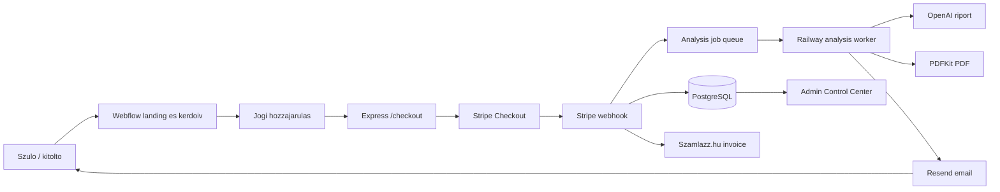
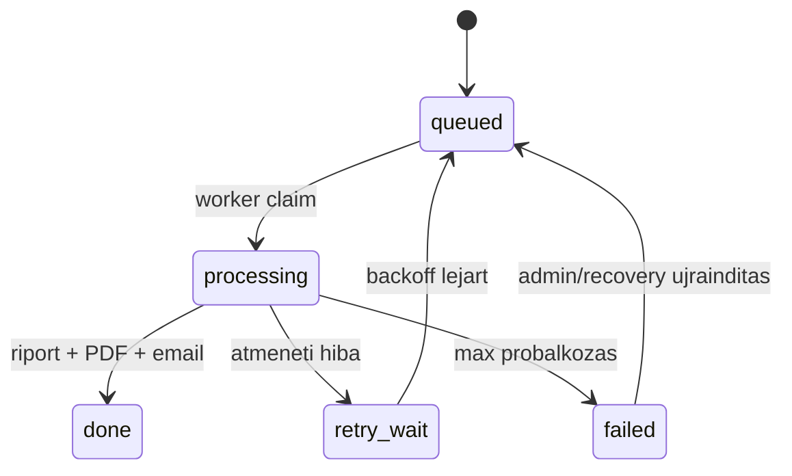

# Rendszerarchitektura es folyamatok

## Rendszerkep

A NeuroMap Kids egy tobbnyelvu, szuloknek szolo, tajekoztato jellegu gyermekviselkedesi eloszuro rendszer. A felhasznaloi felulet Webflowban fut, a backend Node.js/Express alkalmazas Railwayen, az allapot PostgreSQL-ben van, a fizetes Stripe, a riportiras OpenAI, a PDF PDFKit, az email Resend, a szamlazas Szamlazz.hu alapu.



## Frontend reteg

A Webflow oldal adja a hostingot, az oldalstruktura egy reszet, a fejlécet, a logot es az embedeket. Az osszetett runtime kulso JavaScript fajlbol jon:

- `public/webflow/engine.js`
- `public/webflow/legal-consent.js`
- `public/webflow/checkout-pages.js`
- `public/banks/triage.embed.js`
- `public/banks/all-banks.bundle.js`

Az engine egyszerre kezeli a landing integraciot, a nyelvet, a kerdoiv allapotat, a kerdesszelekciot, a pontozast, a summary UI-t, a csomagvalasztast, a consent receiptet es a checkout inditasat. Ezert egy uj landing page nem lehet fuggetlen, tetszoleges HTML: meg kell tartania a `WEBFLOW_LANDING_CONTRACT.md` szerzodeset.

## Kerdoiv es dontesi folyamat

1. A felhasznalo nyelvet valaszt.
2. A landing CTA megnyitja a kerdoiv modot.
3. A jogi hozzajarulasi runtime megmutatja a megfelelo nyelvu tajekoztatast es bizonylatot ker a backendtol.
4. A triage engine 25 kerdest valaszt: teruletenkent 5 darabot az ADHD, ASD, szorongas, depresszio es tanulas temakorokbol.
5. A valaszok 0-3 skalan erkeznek.
6. Az Engine Intelligence V2 rangsorolja a teruleteket, es eldonti az elsodleges valamint masodlagos fokuszt.
7. A rendszer 30, subdomain- es `stemKey`-diverzifikalt specifikus kerdest valaszt az elsodleges bankbol.
8. Ha a ket vezeto jel kozeli, 5 kiegeszito kerdest adhat.
9. A summary strukturalt, nem diagnosztikai elozetes osszegzest mutat.
10. A felhasznalo Standard vagy Plus csomagot valaszt, majd checkoutot indit.

Az engine altal kuldott pontszam es summary nem lehet a backend egyetlen bizalmi forrasa. A checkout normalizalo csak ismert kerdesazonositokat es valaszokat fogad tovabb, a szerver a bankintegritast es a csomagot ellenorzi.

## Checkout szerzodes

A frontend `POST /checkout` hivasa legalabb a kovetkezo logikai adatokat adja:

- nev vagy becenev, maximum 120 karakter;
- email, maximum 254 karakter;
- tamogatott nyelv;
- `packageCode`: `standard_v1` vagy `plus_v1`;
- gyermek eletkora 3-17;
- hozzajarulasi bizonylat: ervenyes UUID es rovid eletu token;
- pontosan 25 triage kerdesazonosito es 25 darab 0-3 valasz;
- pontosan 30 specifikus kerdesazonosito es 30 darab 0-3 valasz;
- opcionálisan pontosan 5 extra kerdes es valasz;
- kerdoivverzio.

A kliens altal kuldott kerdesszoveg nem hiteles adat. A `normalizeCheckoutPayload.js` kontrollkaraktereket tavolit es a szerver altal ismert mezokre szukiti a bemenetet.

## Fizetes es webhook

1. A checkout controller validalja es normalizalja a payloadot.
2. A session adatbazisrekord letrejon vagy idempotensen ujrahasznalodik.
3. A backend a sajat termekkatalogusabol keri az arat; a kliens altal kuldott ar nem hiteles.
4. Stripe Checkout session keszul lokalizalt success/cancel URL-lel.
5. A Stripe webhook nyers request bodybol ellenorzi az alairast.
6. A webhook esemeny idempotensen rogzul.
7. Sikeres fizetesnel a session `paid` allapotba kerul, elemzesi job es invoice claim keszul.
8. A success oldal tokennel kerdezi le a feldolgozasi allapotot, es nem iger irrealisan azonnali emailt.

## Queue es worker

A Railwayen ket kulon service ugyanazt a kodbazist hasznalja:

- web: `RAILWAY_SERVICE_ROLE=web`;
- worker: `RAILWAY_SERVICE_ROLE=worker`.

A `scripts/railway-start.js` valasztja ki az entrypointot. A worker lease-ekkel foglal jobot, heartbeatet ir, retry/backoffot hasznal, es stale jobokat ujra sorba lehet allitani. A worker nem publikus HTTP-szerver.



## Riport es PDF

- Az `analysis.service.js` OpenAI Responses API-t hasznal.
- Az alapmodell kornyezeti valtozobol jon; alapertelmezett `gpt-4.1-mini`.
- A riport 11 reszes, korosztalyos, szulobarat es ovatos nyelvezetu.
- A report contract ellenorzi a szerkezetet, es hiba eseten egyszer ujrageneralhat.
- A PDFKit lokalizalt Noto fontokat hasznal latin, kinai, japan es arab szoveghez.
- A PDF verzio es oldaltoresek kulon szolgaltatasban vannak; vizualis valtoztatast PDF renderelessel kell ellenorizni.
- Plus csomaghoz megoszthato osszefoglalo, 14 napos megfigyelesi naplo es tovabbi segedanyagok tartoznak.

## Email es szamlazas

- A Resend kuldes idempotencia-vedett.
- Kulon statusz mezok kovetik a riportemailt, szerzodeses visszaigazolast, emlekeztetot es follow-upot.
- Sikertelen riportemail automatikusan es adminbol is ujraprobalhato.
- Szamlazz.hu szamla automatikusan keszulhet a sikeres fizetes utan.
- A szamla nyelve `auto` beallitasnal a kerdoiv nyelvet koveti a tamogatott szolgaltatoi nyelvek/fallback szabalyai szerint.

## Jogi es adatvedelmi folyamat

- A landing megtekintesehez nem kell egeszsegugyi hozzajarulast kerni.
- A kerdoiv megkezdese elott reszletes tajekoztatas es kifejezett hozzajarulas kell.
- A backend rovid eletu consent receiptet ad, amely a checkoutnal kotelezo.
- A consent esemenyek, visszavonas es adatvedelmi kerelmek adatbazisban kovethetok.
- Adatmegorzesi es torlesi folyamatok kulon service-ben es cron route-okban vannak.
- A marketing szerveroldali esemenyek erzekeny gyermek-jolleti funnel miatt alapertelmezetten ki vannak kapcsolva.

## Admin es monitoring

Az `/admin/dashboard` egy sajat Control Center. Admin session/cookie hitelesitest hasznal, es attekinti:

- sessionok es fizetesi allapotok;
- queue es worker allapot;
- elemzesi, PDF- es emailhibak;
- invoice allapot;
- post-payment recovery;
- email deliverability;
- engine dontesi audit es bankminoseg;
- i18n audit;
- Webflow loader verziok;
- operational alerts es kampanykapacitas.

Az admin felulet nem lehet publikus uzleti API. Minden muveleti route vedett, auditnaplozott es rate-limitelt.

## Fo publikus route-feluletek

```text
POST /checkout
POST /checkout/retry/:id
POST /webhook
GET  /session/status/:id
GET  /session/:id
GET  /observation/:token
GET  /observation/api/:token
POST /observation/api/:token/entries
GET  /legal/config
POST /legal/consents
GET  /legal/consents/:id
POST /legal/consents/:id/withdraw
POST /legal/privacy-requests
GET  /health
GET  /health/version
GET  /admin/dashboard
```

A teljes admin es cron route-listat a kodbol kell frissen kigyujteni, mert ez a felulet gyakran bovul.

